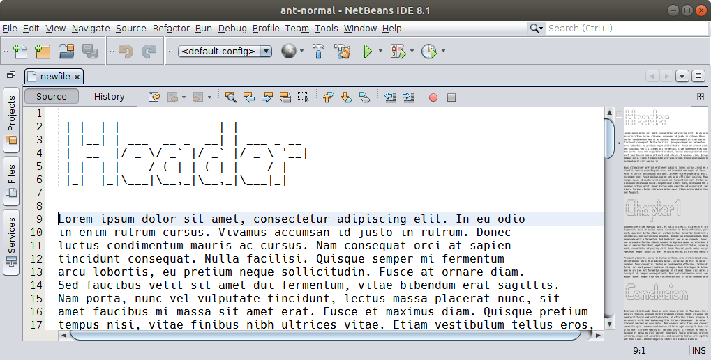

# NB Figletize
A NetBeans IDE plugin to create text banners with [FIGlet fonts](http://www.figlet.org/).

## Requirements and Installation
The plugin works in **NetBeans 8.1 and above** running on a **JDK 7 and above**.

To perform a manual install download the desired `nbm` package from the [releases page](https://github.com/AlexFalappa/nb-figlet/releases) , go to *Tools > Plugins > Downloaded* and click the *Add Plugins...* button. Choose the downloaded `nbm` package file then click *Install*.

## Issues and Documentation
Bug tracking: [GitHub Issues](https://github.com/AlexFalappa/nb-figlet/issues)

Getting Started: [Quick Tour](https://github.com/AlexFalappa/nb-figlet/wiki/Quick-Tour)

## License
The plugin and its source code are licensed under [Apache 2.0 license](http://www.apache.org/licenses/LICENSE-2.0).

## References and Related Projects
* [FIGlet](http://www.figlet.org/): the main webpage
* [JFiglet](https://github.com/dtmo/jfiglet): Java implementation of FIGlet
